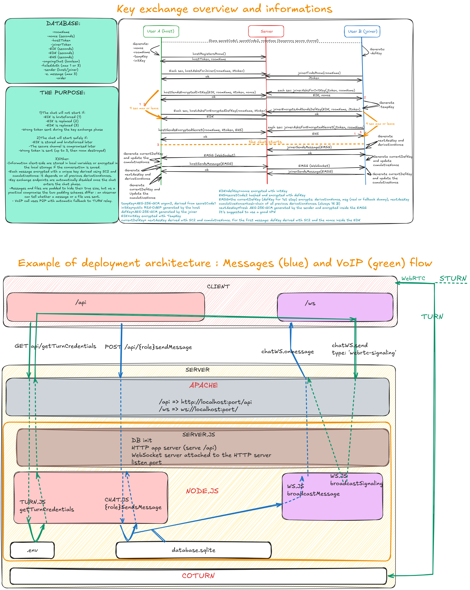

# Chat SDX Lite

Based on [Chat SDX](https://github.com/Davideva993/Chat-SDX) — an experimental end-to-end encrypted chat idea. This version makes some compromises for usability and adds features, while keeping the core encryption scheme. 

Compared to the original:
- **Removed** dummy traffic system (simplified to real-time messaging)
- **Added** WebSocket for persistent connection (replaced polling)
- **Added** VoIP calling via WebRTC
- **Added** encrypted save/load of conversations (original was ephemeral)
- **Added** file sending (up to ~1 MB per file, padded to 1 MiB)
- **Changed** padding — files are padded to exactly 1 MiB, messages to exactly 1024 bytes, so an observer can tell a message from a file by size (original didn't send files)
- **Added** Database SQLite via Sequelize (instead of the ephemeral in-memory database)
- **Kept** the same key exchange (Argon2id + RSA-OAEP 4096) and key ratcheting

**Message structure:** `[3-digit length][real message][padding to 1024 bytes]` → encrypted with currentDefKey + `[32B next AES key][16B derivation nonce]`
**File structure:** `[4-char extension][7-digit length][file bytes][padding to 1 MiB]` → encrypted with currentDefKey + `[32B next AES key][16B derivation nonce]`

This is not audited and remains an experiment. Feedback welcome.

 for key exchange informations and deployment architecture example. 


## Features

- Encrypted messaging with AES-256-GCM and forward secrecy
- End-to-end encrypted VoIP (WebRTC with DTLS-SRTP)
- Encrypted conversation save/load

## Quick start

```
cd back
cp .env.example .env
# edit .env with your config
npm install
npm start
```

Frontend is served by the Node server as static files.

## Deploy

All components run on the same VDS. Requires Node.js. Coturn recommended for VoIP relay behind NAT. Reverse proxy (Apache/Nginx) optional.
Can be deployed with Docker (node and coturn services).

## Config

See `.env.example` and `turnserver.conf.example`.

## License

AGPL-3.0
